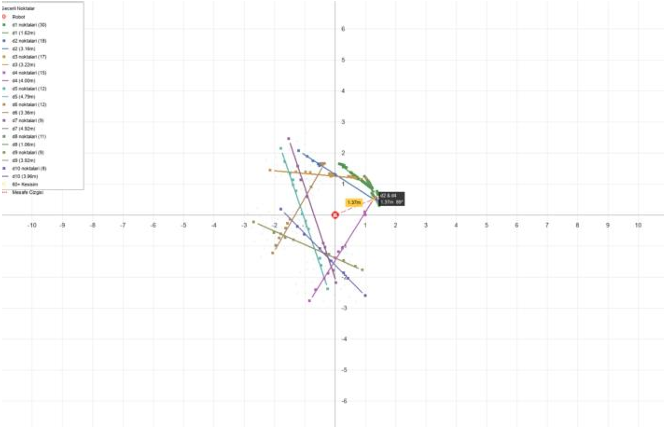

### Lidar Verileri ile Hassas Yanaşma ve Geometrik Hesaplamalar 
Bu proje, otonom mobil robotların şarj ünitesine yüksek hassasiyetle yanaşabilmesi amacıyla LiDAR verilerini işleyen, geometrik analiz yapan ve sonuçları görselleştiren bir yazılımdır.

## 🛠️ Yöntem ve Algoritma (Methodology)
* **Veri İşleme ve Koordinat Dönüşümü:** TOML dosyasından okunan ham menzil verileri, geçerli sınır değerlerine göre filtrelenir.+1Kutupsal koordinat sistemindeki veriler, Kartezyen koordinat sistemine ($x, y$) dönüştürülür.
* **MLESAC ile Doğru Tahmini:** RANSAC'ın geliştirilmiş bir versiyonu olan MLESAC algoritması kullanılarak 2000 iterasyon boyunca en yüksek "skor"a sahip doğrular aranır.+1Skor Fonksiyonu: $skor = \Sigma \exp(-(mesafe^{2}) / (2\sigma^{2}))$ formülü ile gürültüye karşı dayanıklı bir modelleme yapılır.
* **Köşe Tespiti ve Analiz:** Doğruların eğimleri ve denklemleri üzerinden kesişim noktaları hesaplanır.+1Sadece $60^{\circ}$ ve üzerindeki açılar "geçerli köşe" olarak kabul edilir.

* **Grafiksel Gösterim:** SDL2 ve SDL_ttf kütüphaneleri ile ızgara sistemi (grid) ve dinamik etiketler eşliğinde robotun konumu (0,0), algılanan noktalar, doğrular ve en yakın köşe noktası gerçek zamanlı olarak görselleştirilir.

## 📚 Kullanılan Teknolojiler

* **Dil:** C 

* **Görselleştirme:** SDL2 & SDL_ttf 

* **Algoritma:** MLESAC & En Küçük Kareler Yöntemi (Least Squares) 

* **Geliştirme Ortamı:** Code::Blocks 

## 📊 Deneysel Sonuçlar

* Testler sırasında `scan_data_NaN.toml` dosyası kullanılmış ve her çalıştırmada ortalama 9-11 adet doğru başarıyla tespit edilmiştir.

* Tespit edilen kesişim noktalarının robota olan mesafeleri fiziksel ortamla uyumlu olarak 1-6 metre aralığında ölçülmüştür.

## 📂 Örnek Veri Setleri (TOML)
Proje klasöründe yer alan `.toml` dosyaları, LiDAR sensöründen gelen farklı senaryolara ait ham verileri içerir. Algoritmayı test etmek için bu dosyaları kullanabilirsiniz:

* `scan_data_NaN.toml`
* `lidar1.toml`
* `lidar2.toml`
* `lidar3.toml`
* `lidar4.toml`
* `lidar5.toml`

**Not:** Yazılımı çalıştırırken dosya yolunu bu dosyalardan birine yönlendirerek farklı sonuçları gözlemleyebilirsiniz.

## 🏁 Sonuç
Bu çalışma, LiDAR sisteminin kullanım alanlarını ve verilerin işlenmesi için gereken karmaşık algoritmaları pratik bir uygulama üzerinden öğretmiştir. Proje, teorik programlama bilgisinin günlük hayattaki otonom sistemlerde nasıl somutlaştığını göstermektedir.

## 👥 Katkıda Bulunanlar
Bu proje, Kocaeli Üniversitesi Programlama Laboratuvarı dersi kapsamında geliştirilmiştir.

[Ahsen İkbal TÜRK](https://github.com/CengAIT)

[Zehra GÜLMÜŞ](https://github.com/zehra-ceng)

